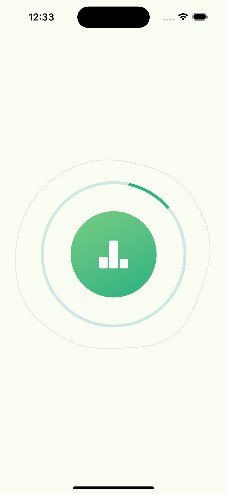

# Analyzing Goals Loading 

I crafted this project during my SwiftUI animation learning path, exploring the use of ```animation```, ```spritekit particle``` and ```Morphing(blob) shape``` .

## Inspiration 💡

The main idea of this source code based on [Loading](https://dribbble.com/shots/18701721-Loading) created by [DΞNYS S.](https://dribbble.com/sergushkindotcom).

## Screenshots 🌃



## Acknowledgments 💡
To create Morph shape, I've used a tutorial by [Alex Dremov](https://alexdremov.me/swiftui-advanced-animation/).

## The tech stack used in this project 🛠

- SwiftUI
- Animation (spring)
- Shape (Path)
- Morph shape
- spritekit particle

## Tools

- Xcode 15.2
- Swift 5.9.2

## Usage

1. Clone the repository:

  ``` bash
    git clone https://github.com/helloItsHEssam/AnalyzingGoalsLoading.git
  ```

###  Contributing 🤝

Contributions, issues, and feature requests are welcome! Feel free to fork the repository and submit a pull request with your changes.

## License

Please check [LICENSE](LICENSE) for details.